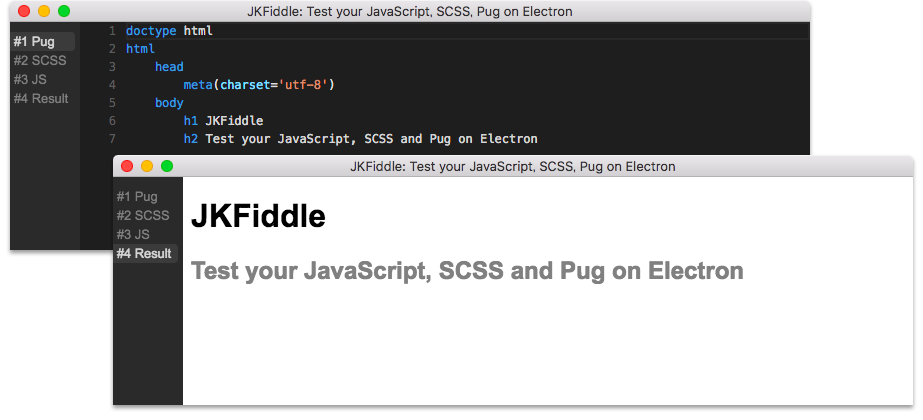

# JKFiddle

Test your JavaScript, SCSS and Pug on Electron. The application is inspired by [JSFiddle](https://jsfiddle.net/).



## Requirements

* Electron v1.4.6
* yarn v0.17.9

## Usage

```bash
git clone https://github.com/mimorisuzuko/jkfiddle.git
cd jkfiddle
yarn start
```

### Shortcuts

* ⌘ + ${n}: Move to a panel of Pug, SCSS, JavaScript or Result

## Develop

### Setup

```bash
git clone https://github.com/mimorisuzuko/jkfiddle.git
cd jkfiddle
yarn
```

### Scripts

Edit codes in `src/`.

```bash
yarn run webpack -- -w
yarn run pug
yarn run scss
```
